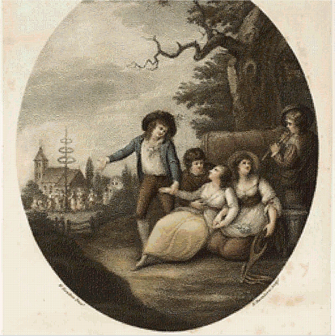

## Infinite tiling

Infinite tiling of artworks from the Art Institute Chicago

You can visit the website at:

https://furstenheim.github.io/infinite-mosaic/

It accepts two parameters, big mode and autoplay. Only recommended if you have a powerful computer.

### Big layout

256 x 256 tiling instead of 128 x 128

https://furstenheim.github.io/infinite-mosaic/?size=big

### Autoplay
https://furstenheim.github.io/infinite-mosaic/?autoplay=true

## Acknowledgment
Images are provided by the Art Institute Chicago under [Creative Commons Zero license](https://www.artic.edu/image-licensing).

Thanks to Jetbrains for providing open source licenses.

